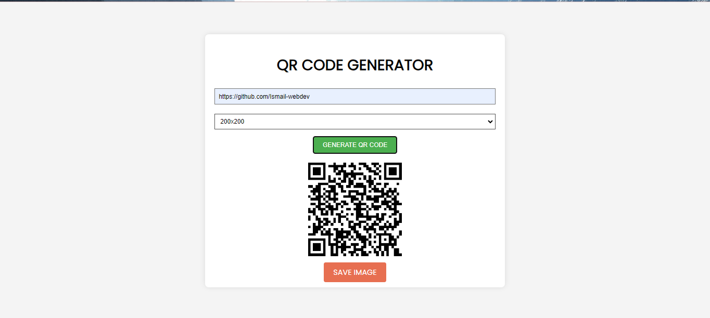

# Qr-Code-Generator

A simple QR code generator created using HTML, CSS, and JavaScript with the help of the [qrcodejs library](https://github.com/davidshimjs/qrcodejs).

## Features

- Generate QR codes for various content types such as text, URLs, etc.
- Customizable QR code size.
- Easy integration into web projects.

## Demo

[Check out the live demo](https://ismail-webdev.github.io/Qr-Code-Generator/)

## Screenshots



## Usage

1. Include the qrcodejs library in your HTML file using cdnjs.com:

   ```html
           <script src="https://cdnjs.cloudflare.com/ajax/libs/qrcodejs/1.0.0/qrcode.min.js"
            integrity="sha512-CNgIRecGo7nphbeZ04Sc13ka07paqdeTu0WR1IM4kNcpmBAUSHSQX0FslNhTDadL4O5SAGapGt4FodqL8My0mA=="
            crossorigin="anonymous" referrerpolicy="no-referrer"></script>

## Development

To run the project locally, follow these steps:

1. Clone the repository:

   ```bash
   git clone https://github.com/Ismail-webdev/Quote-Generator.git
To run the project locally, follow these steps:

1. Clone the repository:

   ```bash
   git clone https://github.com/Ismail-webdev/Quote-Generator.git
